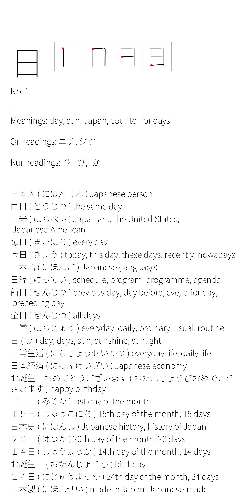
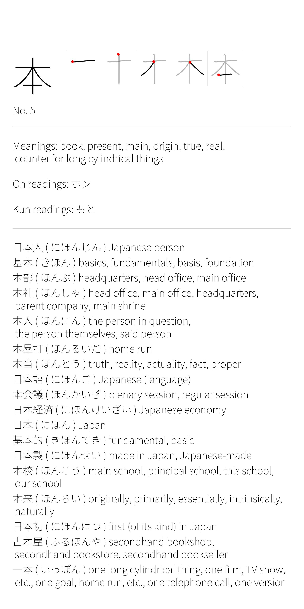

# kanji-cards

This project generates cards aimed for studying Kanji. Each card contains

- The Kanji in question
- The number of the Kanji, in order of (approximate) frequency of occurrence
- Stroke order diagrams, showing how to write the Kanji
- Meanings of the Kanji
- On'yomi readings of the Kanji
- Kun'yomi readings of the Kanji
- Words containing the Kanji, in order of (approximate) frequency of occurrence, including the word in kanji, the word's reading and the word's meanings

See the below example of two cards.

  
   

The cards are PDF files. They have a shape aimed at being looked at from a smartphone. See the section `Building, running, testing` for information on how to generate the cards.

This project uses some external data sources and fonts. See the sections `External data` and `Copyright, license, attribution` for more information.

# Source code overview

The "main" function of this program is the test case `run_main` located in `create_card_tests.cpp`. `run_main` in turn uses the other files and classes. See each header file for more details about each file.

# Building, running, testing

Run `./build_run_test.sh` located in the root level of this repository to, well, build the project and run the tests. Run `./build_run_test run_main` to run the main function that generates the kanji cards. The output is located in `build/out`.

# External data and acknowledgments

This project uses external data sources the build the cards. A big thank you to them!

- [JMdict_e](https://www.edrdg.org/wiki/index.php/JMdict-EDICT_Dictionary_Project) for information on words. Checked in at `ext_assets`.
- [kanjidic2](https://www.edrdg.org/wiki/index.php/KANJIDIC_Project#Content_&_Format) for information on kanji. Checked in at `ext_assets`.
- [KanjiVG](https://kanjivg.tagaini.net/) for stroke order diagrams. Checked in at `ext_assets`.
- [2242 KANJI FREQUENCY LIST 1.1](https://docs.google.com/spreadsheets/d/1MBYfKPrlST3F51KIKbAlsGw1x4c_atuHfPwSSRN5sLs/edit?pli=1&gid=496425456#gid=496425456) [(and here)](https://www.researchgate.net/publication/357159664_2242_Kanji_Frequency_List_ver_11) for frequency order of Kanji. Downloaded during build time to `build`.
- [Noto Sans Japanese](https://fonts.google.com/noto/specimen/Noto+Sans+JP) as the font used. Checked in at `ext_assets`.

Also, a special thanks to [jisho.org](https://jisho.org/), an awesome online Japanese dictionary that I've drawn inspiration from.

# Copyright, license, attribution

The license for this repository is GPL v3, as specified by the separate `LICENSE` file, with the following exceptions and remarks:

Exception 1. Files in `ext_assets`. This project uses assets from external projects. They are stored as copies inside `ext_assets` alongside copyright files. Their copyright notices and attribution are also shown further down in this document. Since they are copies, I don't claim any copyright or ownership over them. I simply redistribute together with this repository to make building, testing and running my code simpler and more self-contained.

Exception 2. Files in `examples`. The example cards are licensed under [CC BY-SA 4.0](https://creativecommons.org/licenses/by-sa/4.0/). They contain material, and modified material, from JMdict_e.gz (CC BY-SA 4.0), kanjidic2.xml.gz (CC BY-SA 4.0), kanjivg-20240807-all.zip (CC BY-SA 3.0) and Noto_Sans_JP.zip (OFL 1.1). OFL 1.1 doesn't apply to material created using the font. CC-BY SA 3.0 and 4.0 allow derived material to be licensed under CC-BY SA 4.0. However, CC-BY SA 3.0 doesn't allow derived material to be licensed under GPL v3, hence the special case for the example cards.

Remark 1. It could be argued that some test files contain material from JMdict_e.gz and kanjidic2.xml.gz since they contain lots of words, meanings, etc found in JMdict_e.gz and kanjidic2.xml.gz. However, they are licensed under CC-BY SA 4.0, and the test cases are licensed under GPL v3, this is OK.

No copyright infringement intended. If you see an issue, I'm more than happy to fix it.

## JMdict_e.gz and kanjidic2.xml.gz

This package uses the [JMdict/EDICT](https://www.edrdg.org/wiki/index.php/JMdict-EDICT_Dictionary_Project) and [KANJIDIC](https://www.edrdg.org/wiki/index.php/KANJIDIC_Project) dictionary files. These files are the property of the [Electronic Dictionary Research and Development Group](https://www.edrdg.org/), and are used in conformance with the Group's [licence](https://www.edrdg.org/edrdg/licence.html). 

## kanjivg-20240807-all.zip

Stroke diagrams are based on [KanjiVG](https://kanjivg.tagaini.net/). KanjiVG is copyright © 2009-2024 Ulrich Apel. It is released under the [Creative Commons Attribution-Share Alike 3.0](https://creativecommons.org/licenses/by-sa/3.0/) license. 

## Noto_Sans_JP.zip

Copyright 2014-2021 Adobe ([http://www.adobe.com/](http://www.adobe.com/)), with Reserved Font Name 'Source'

This Font Software is licensed under the SIL Open Font License, Version 1.1 . This license is copied ~~below~~ in `ext_assets/Noto_Sans_JP.zip.license`, and is also available with a FAQ at: [https://openfontlicense.org](https://openfontlicense.org)

SIL OPEN FONT LICENSE Version 1.1 - 26 February 2007 
